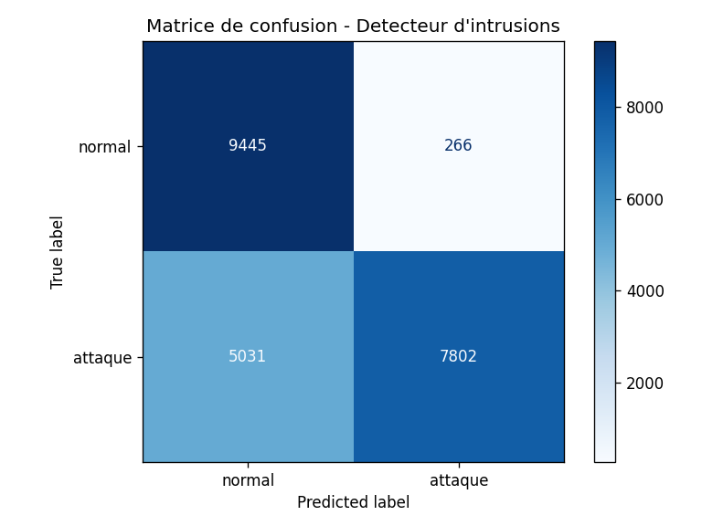
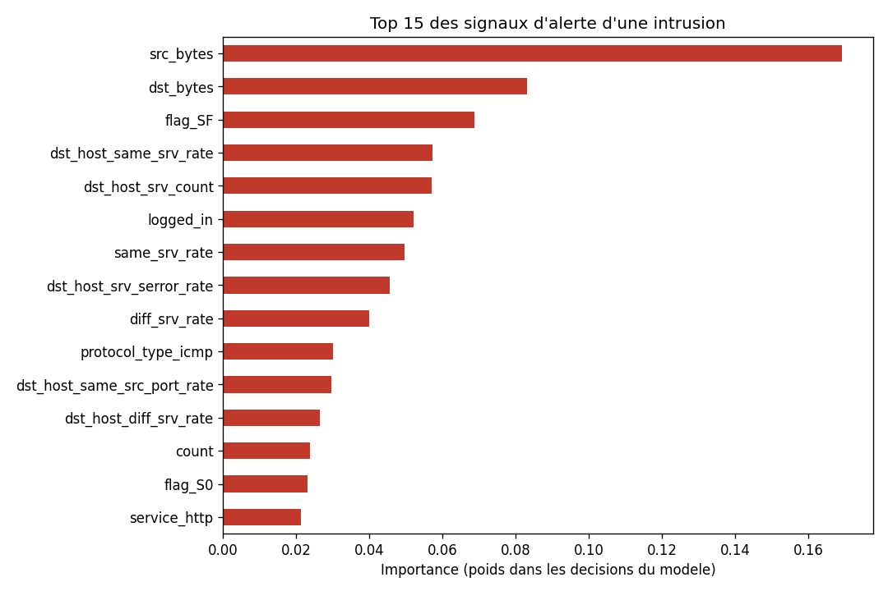

# NIDS-ML — Détection d'intrusions réseau par Machine Learning

Preuve de concept d'un **système de détection d'intrusions (NIDS)** entraîné à
distinguer le trafic réseau **normal** des **attaques** (DoS, scans de ports,
intrusions...) à partir du dataset de référence **NSL-KDD**.

> Projet réalisé en autonomie (week-end) pour explorer l'intersection
> **Data Science / IA** et **Cybersécurité**.

---

## 🎯 Objectif

Entraîner un modèle de classification capable d'analyser les caractéristiques
d'une connexion réseau (volume de données, protocole, état TCP, taux d'erreurs...)
et de prédire si elle est **légitime** ou **malveillante**.

## 🗂️ Données — NSL-KDD

- **125 973** connexions d'entraînement, **22 544** de test.
- **41 caractéristiques** par connexion (durée, protocole, octets échangés,
  taux d'erreurs de connexion, nombre de connexions vers un même service...).
- Réparties en **normal** (53,5 %) / **attaque** (46,5 %) — jeu équilibré.
- ⚠️ Particularité : le jeu de test contient des **types d'attaques absents
  de l'entraînement**, ce qui simule la confrontation à des menaces **inédites**
  (type zero-day) et explique l'écart train/test.

## 🛠️ Pipeline

| Étape | Fichier | Rôle |
|-------|---------|------|
| Exploration | `src/explore.py` | Structure et répartition des données |
| Préparation | `src/preprocessing.py` | Encodage one-hot (41 → 122 features), cible binaire |
| Entraînement | `src/train.py` | RandomForest (100 arbres), sauvegarde du modèle |
| Évaluation | `src/evaluate.py` | Matrice de confusion, precision / recall |
| Interprétation | `src/feature_importance.py` | Top 15 des signaux d'alerte |

## 📊 Résultats

| Métrique | Valeur | Lecture |
|----------|--------|---------|
| Précision globale (test) | **76,5 %** | sur des attaques en partie inédites |
| **Precision** (attaques) | **96,7 %** | quand il alerte, il a raison 96,7 % du temps |
| **Recall** (attaques) | **60,8 %** | il attrape 6 attaques sur 10 |
| Faux positifs | 266 | très peu de fausses alertes |
| Faux négatifs | 5 031 | attaques inédites non détectées |

<p align="center">
  
  
</p>

**Top des signaux discriminants appris par le modèle :** volume de données
échangé (`src_bytes`, `dst_bytes`), état de la connexion TCP (`flag_S0` =
signature de scan de ports), densité de connexions vers un même service
(`dst_host_srv_count` = scan / flood), taux d'erreurs SYN.

➡️ Le modèle a **redécouvert de façon autonome les indices** qu'un analyste
SOC utilise (scans, floods, volumes anormaux).

## 🧠 Analyse critique & pistes d'amélioration

- Le modèle est **précis mais prudent** : excellent compromis contre la fatigue
  d'alerte, mais recall perfectible face aux attaques inconnues.
- **Pistes :** ajuster le seuil de décision pour privilégier le recall,
  rééquilibrer les classes, tester un gradient boosting (XGBoost), passer en
  classification **multi-classes** (identifier le *type* d'attaque), ou ajouter
  une couche de détection d'anomalies pour les menaces inédites.

## 🚀 Reproduire

```powershell
# 1. Récupérer le dataset NSL-KDD
mkdir data
curl.exe -L -o data\KDDTrain+.txt "https://raw.githubusercontent.com/HoaNP/NSL-KDD-DataSet/master/KDDTrain%2B.txt"
curl.exe -L -o data\KDDTest+.txt  "https://raw.githubusercontent.com/HoaNP/NSL-KDD-DataSet/master/KDDTest%2B.txt"

# 2. Environnement + dépendances
python -m venv .venv
.venv\Scripts\python.exe -m pip install pandas scikit-learn matplotlib seaborn joblib

# 3. Pipeline
$env:PYTHONPATH = "src"
.venv\Scripts\python.exe src\train.py        # entraîne + sauvegarde le modèle
.venv\Scripts\python.exe src\evaluate.py     # métriques + matrice de confusion
.venv\Scripts\python.exe src\feature_importance.py
```

## 🧰 Stack

Python · pandas · scikit-learn (RandomForest) · matplotlib · seaborn

---

*Auteur : Mouhamed Ndour — étudiant en double licence Mathématiques-Informatique.
Projet personnel data/IA appliqué à la cybersécurité.*
